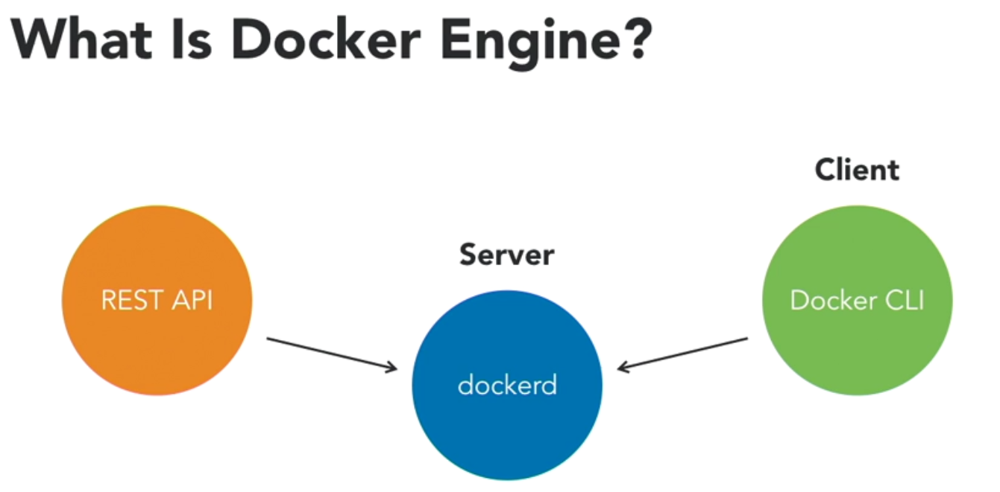
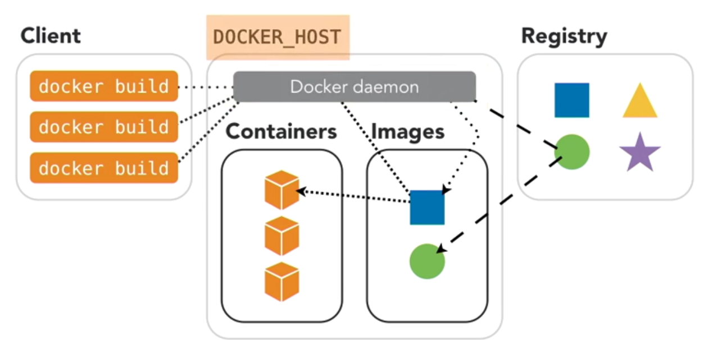

# Docker Engine

Docker engine is the required engine in both community and enterprise editions.
It has following components

* dockerd --> is the docker engine or docker server
* docker rest apis
* client --> docker cli

Docker doemon program runs on Docker Host where docker engine is running. 
We invoke/command Docker Engine by making cli commands using Docker Client. Docker client can be remote or local to docker host.

# Docker Namespaces
Namespaces are used to separate resources on VM and resources in Docker Container.
These are used for - Processes, Mounts, IPC, Networks, Users etc.
Namespaces isolate Docker Containers from hosting VMs or hosting machines.

# Docker Control Groups (cgroups)
They provide resource isolation. To control resouce allocation and usage by containers.
e.g. CPU limits, CPU reservation, Memory Limits, Memory reservation.
 CGroup limits container resoure allocation and usage, and avoid server resourve exhausting, and impacting other docker hosts runnning on same server.

