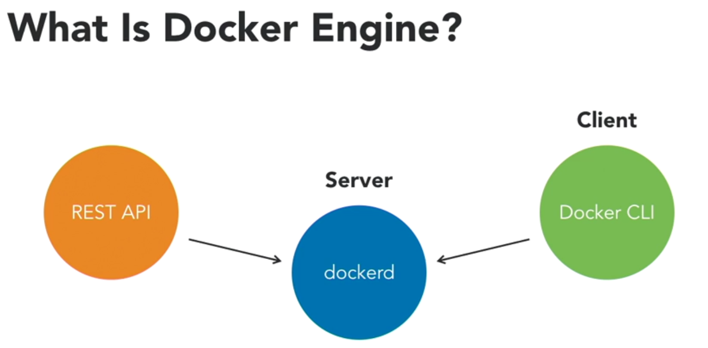

Docker engine is the required engine in both community and enterprise editions.
It has following components

* dockerd --> is the docker engine or docker server
* docker rest apis
* client --> docker cli

Docker doemon program runs on Docker Host where docker engine is running. 
We invoke/command Docker Engine by making cli commands using Docker Client. Docker client can be remote or local to docker host.

