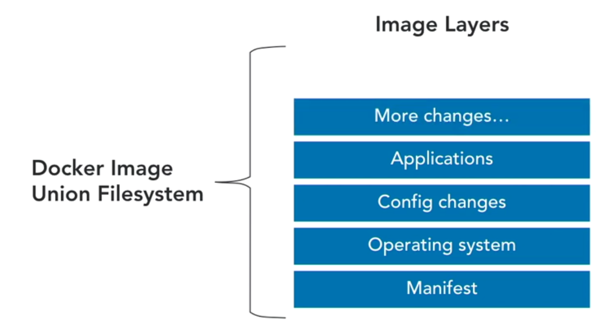

# What is a docker image
An image is an executable package that includes every thing that it needs to run - i.e. the code, the runtime, the libraries, variables, configurations, etc..
Images can not be changed. But we can create new images.

# WHat is a container
A ruuning instance of an image is a container.
An image is a container that is not running.
Containers are stateless.

To run a container from an image
> docker container run <image_name>    

To run a container in background as daemon.
> docker container run -d <image_name>    

# Dockerfile
A text file that contains all commands needed to build an image.
> docker build .
command is used to create an image from a docker file named Dockerfile in the current directory.

To inspect an image and see its details.
> docker image inspect <image_id>

TO see what all steps are executed while creating an image.
> docker image history <image_id>

To tag an image.
> docker image tag source_name:tag target_name:tag
> docker image tag <image_id> myimage:tag1
> docker image tage unbutu:latest akhilgupta81/ubuntu:myunbuntu

# docker file instructions

## FROM
defined the base image. it should be the first instruction in docker file.
## ADD
copies a file into an image. it suports tar and remote url
## COPY 
copy files into an image. preferred over ADD.
## VOLUME
creates a mount point
## ENTRYPOINT
the exeuctable to run when container is run
## CMD 
provide arguments for the entrypoint. only one is allowed.
## EXPOSE
documents the ports that should be published
## ENV
define env varibales in the container
## ONBUILD
command to run when another image is build from this image
## RUN
run a new command in a new layer
## WORKDIR
defines the working directory of the container

# DOCKER BUILD command options
-f , --file --> specify the build file name with file path

build context --> build commands add all the files and folders that are present in the buld context folder. To ignore file to be added into an image use .dockerignore file.
--no-cache`=trye --> build will not pull needed images from local cache and it will pull all needed images from registry.
-t --> tag for the image e.g. -t unbuntu:v2   here ubuntu is reponame and v2 is tag name.

# Squashing an image
This is to reduce the size of the image.
It sqashes all the layers into one layer to reduce the size of image.
This feature is in experimental mode yet.

Run command to check Experimental : true is set.
> docker version
> docker build --squash -f mydockerfile -t ubuntu:v3 .
By squashing all the layers are merged into one layer.

# export and import
A running container can be exported as an image in a .tar file.
A new image can be created by importing a previously exported .tar file.

> docker container export <container_name> > myimage.tar

> docker image import myimage.tar

